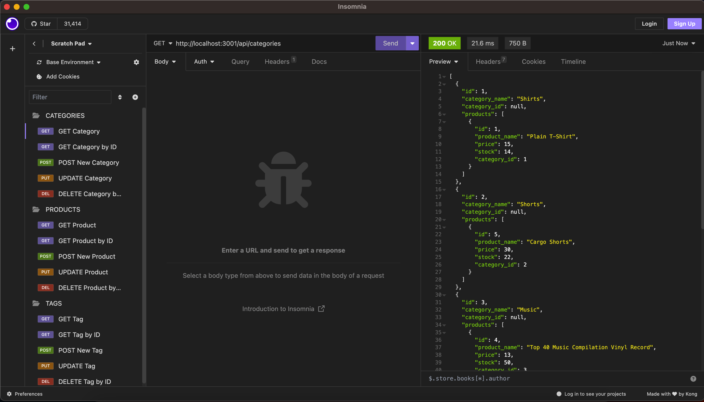
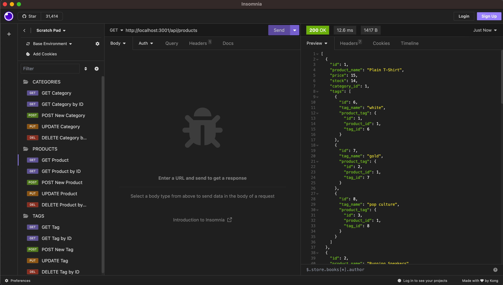
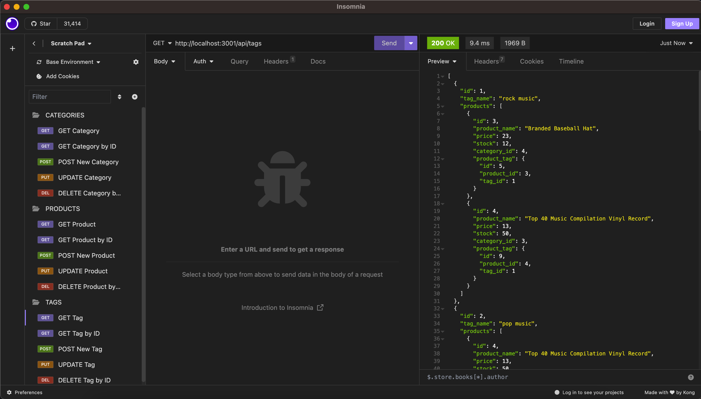

# Storefront Sequelizer

## Description

This is the back end for an ecommerce website. It is built using Node.js, Express.js, MySQL, and Sequelize. The database contains tables for products, categories, tags, and product-tag associations.

APIs and routes are provided to view, add, update, and delete data across the various database tables. Validation and associations between models ensure data integrity. The focus of this application is to provide a functional database CRUD backend using industry standards.

## Table of Contents

- [Storefront Sequelizer](#storefront-sequelizer)
  - [Description](#description)
  - [Table of Contents](#table-of-contents)
  - [Usage](#usage)
  - [Credits](#credits)
  - [Questions](#questions)
  - [License](#license)

## Usage

The following steps provide a guide for setting up and interacting with the backend:

1. Install dependencies using npm install

2. Set up the MySQL database and tables using the provided schema file

3. Seed the database with test data using npm run seed

4. Start the server using npm start

5. Open Insomnia to interact with API endpoints

6. API routes can be tested for categories, products, and tags. For example:
   - View all categories with GET /api/categories
   - Create a new product with POST /api/products
   - Update a tag name using PUT /api/tags/1
   - Delete a product by ID using DELETE /api/products/5

The following images demonstrate the application's appearance and functionality:

[Video Walkthrough Link](https://drive.google.com/file/d/1BVWsvQ45Jvy3_6IlqJDD-a6OcdqOM4SE/view)

## Credits

This project was created for educational purposes as part of the KU Coding Bootcamp curriculum.

The following resources were utilized:

- KU Coding Bootcamp Spot:
    - Provided project requirements and guidelines.
- W3Schools:
    - Reference for general documentation.
- MDN Web Docs:
    - Referenced for general documentation.
- Stack Overflow:
    - Referenced for general documentation.
- NPM:
    - [NPM](https://npmjs.com)
- GitHub:
    - [the-coding-bootcamp](https://github.com/coding-boot-camp):
        - [fantastic-umbrella](https://github.com/coding-boot-camp/fantastic-umbrella)
- MySQL:
    - [MySQL Documentation](https://dev.mysql.com/doc/refman/8.0/en/)
- MySQL2:
    - [MySQL2 Package](https://www.npmjs.com/package/mysql2)
    - [MySQL2 Documentation](https://github.com/sidorares/node-mysql2/tree/master/documentation/en)
- Sequelize
    - [Sequelize Documentation](https://sequelize.org/docs/v6/category/core-concepts/)
- Insomnia:
    - [Insomnia Documentation](https://docs.insomnia.rest)
- Express:
    - [Express Documentation](https://expressjs.com/en/5x/api.html)

## Questions

For any questions, feel free to email me ([joem3847@gmail.com](mailto:joem3847@gmail.com)) or visit my GitHub profile ([jmlouf](https://github.com/jmlouf/)).

## License

This project is available under the following license: MIT. For more information on rights and limitations, please review the [LICENSE](./LICENSE) file.